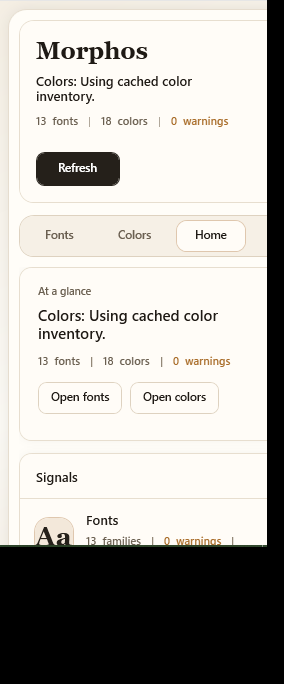

# Morphos

PowerPoint cleanup, without leaving PowerPoint.




Morphos is a Windows VSTO add-in for Microsoft PowerPoint that scans the active deck, highlights the font and color issues worth fixing, and lets you repair them from a compact task pane. It is built for real cleanup work: missing fonts, inconsistent replacements, slow rescans, and the friction of jumping between slide fixes and file-level fixes.

## What Morphos does

- Scans the active presentation automatically when a deck opens or the Morphos pane becomes active.
- Shows a minimal Home tab with the deck signals that matter first.
- Audits fonts with usage counts, installation state, embedding state, and slide-level drilldown.
- Replaces fonts safely from installed Windows fonts and active theme font tokens.
- Audits direct RGB color usage and replaces colors from a purpose-built dialog.
- Jumps back into PowerPoint context from the task pane so cleanup stays grounded in the deck.
- Uses caching and Open XML fast paths to keep repeated scans and large-deck operations responsive.

## Why it exists

PowerPoint cleanup is usually scattered across dialogs, manual slide inspection, and trial-and-error replacement. Morphos pulls that work into one focused workspace:

- scan
- inspect
- replace
- verify

The recent hardening work in this repo also addresses the failure modes that usually make Office add-ins feel unreliable:

- stale replace targets
- missing auto-scan on open
- task-pane recovery after mutations
- slow repeated rescans

## Key capabilities

### Home

The Home tab is intentionally quiet. It surfaces the presentation name, deck-level counts, missing font pressure, embedding state, and quick actions into Fonts or Colors without forcing users through dense copy first.

### Fonts

The Fonts tab is designed for cleanup work:

- compact inventory rows
- responsive drilldown panel
- usage navigation back into PowerPoint
- font replacement that now validates against real installed targets before the dialog is shown

### Colors

The Colors tab groups direct RGB usage into a cleanup-friendly table and keeps replacement actions close to the affected color groups instead of spreading them across separate workflows.

## Architecture at a glance

Morphos uses a layered structure that keeps Office interop, package inspection, and WPF UI responsibilities separate:

- `ThisAddIn.cs`: PowerPoint host lifecycle, task-pane management, warm refresh scheduling, auto-scan triggers
- `Ribbon/`: PowerPoint ribbon entry point
- `UI/` and `Dialogs/`: WPF task pane and replace dialogs
- `ViewModels/`: task-pane state, node trees, async refresh/replace flows
- `Services/PowerPointPresentationService.cs`: presentation scanning, replacement orchestration, validation, mutation handling
- `Services/OpenXml*.cs`: fast package scan and package mutation paths
- `Services/FontScanSessionCache.cs`: presentation-scoped cache for scan results and replacement targets
- `Utilities/`: PowerPoint interop helpers, font registry lookup, selection resolution, retry/filter helpers

## Performance and reliability notes

Morphos is optimized around the pain points of real PowerPoint cleanup:

- Open XML package scanning reduces repeated COM-heavy work.
- `FontScanSessionCache` reuses presentation snapshots when the deck has not materially changed.
- `ComFontAccessorCache` cuts repeated COM property lookup overhead.
- Retry helpers smooth over transient Office busy/rejected-call behavior.
- Replacement target cache versioning prevents stale or impossible font choices from surviving into the live dialog.

## Verification used for this repo

These checks were run against the local add-in build and live PowerPoint automation:

| Check | Purpose |
| --- | --- |
| `.\build-and-run.ps1` | Rebuild, reapply the local manifest, restore `LoadBehavior=3`, verify the COM add-in is connected |
| `.\tests\Verify-FontReplacementTargets.ps1` | Confirms replacement targets include valid scanned fonts and theme tokens |
| `.\tests\Verify-MissingFontReplacementTargets.ps1` | Confirms missing non-installed fonts are not surfaced as replacement targets |
| `.\tests\Verify-StaleFontReplacementTargetCache.ps1` | Confirms stale cached invalid targets are rebuilt before the dialog uses them |
| `.\tests\Verify-PowerPointInteractiveReplace.ps1` | Confirms task-pane auto-scan and live replace dialogs open inside PowerPoint |
| `.\tests\Verify-ServiceFontReplace.ps1` | Confirms live font replacement works on a PowerPoint presentation copy |

## Quick start

### 1. Clone the repo

```powershell
git clone https://github.com/pandadoor/MorphosPowerPointAddIn.git
cd MorphosPowerPointAddIn
```

### 2. Build, register, and load Morphos

```powershell
.\build-and-run.ps1
```

The script rebuilds the add-in, rewrites the local VSTO manifest registration, restores `LoadBehavior=3`, starts PowerPoint, and verifies that `MorphosPowerPointAddIn` is connected.

### 3. Open the pane in PowerPoint

In PowerPoint:

1. Open a presentation.
2. Open the `Morphos` ribbon tab.
3. Click `Open Inspector`.

## Installation and development

- Local setup and troubleshooting: [docs/INSTALLATION.md](docs/INSTALLATION.md)
- Build, test, and architecture notes: [docs/DEVELOPMENT.md](docs/DEVELOPMENT.md)

## Platform scope

Morphos currently targets:

- Windows
- Microsoft PowerPoint desktop
- VSTO / .NET Framework 4.8
- x64 builds

It is not intended for PowerPoint for the web or macOS.

## License

MIT. See [LICENSE](LICENSE).
