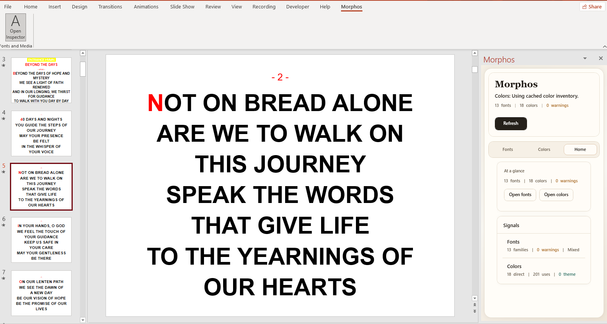
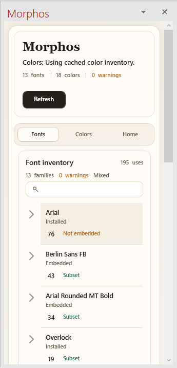
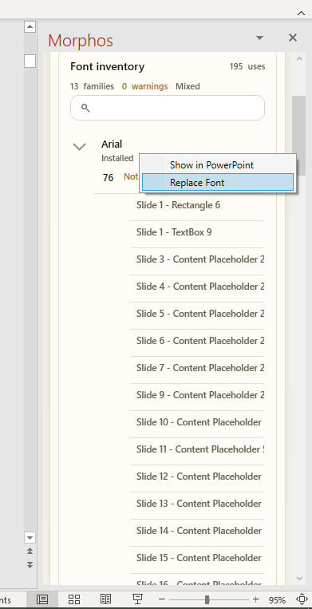
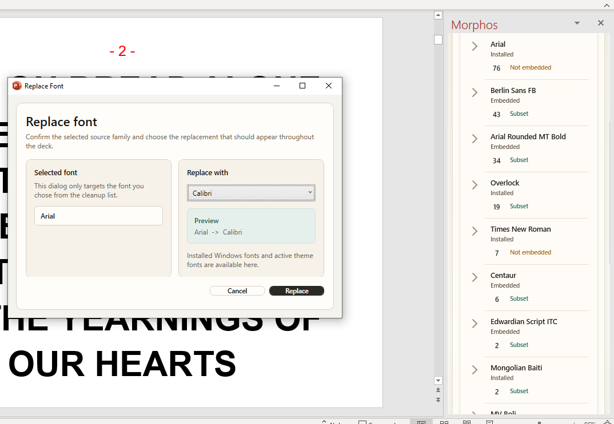
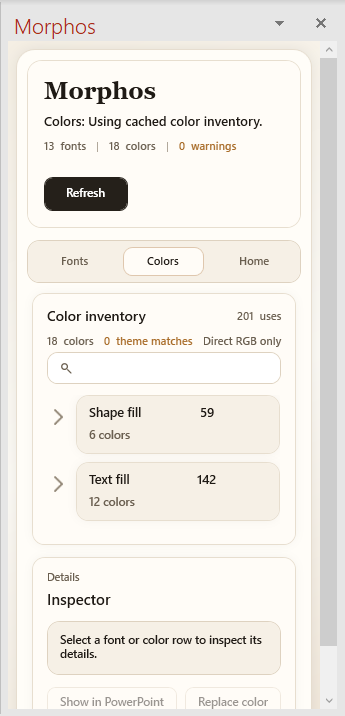
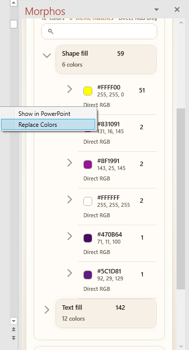
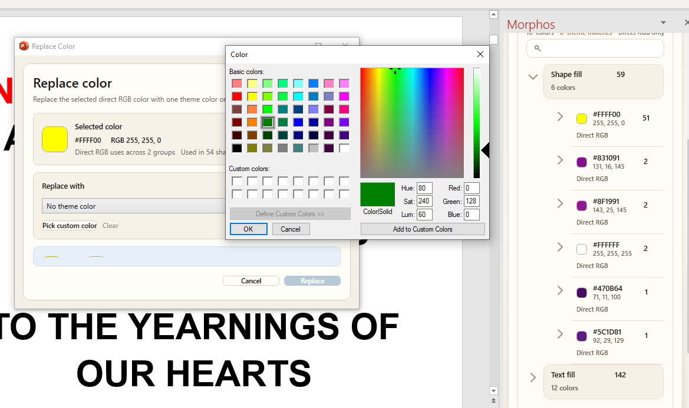

<p align="center">
  
</p>

<h1 align="center">Morphos</h1>

<p align="center">
  <strong>Enterprise-Grade Presentation Asset Management and Quality Assurance for Microsoft PowerPoint</strong>
</p>

<p align="center">
  
  
  
  
</p>

---

## Key Features and Interface

Morphos provides a sophisticated interface for the comprehensive management of presentation assets.

### Workspace Dashboard
The primary dashboard provides a high-level technical summary of the presentation's integrity, including font distribution, color usage metrics, and automated validation warnings.


*Figure 1: Main interface providing a summary of fonts, colors, and real-time scanning status.*

### Font Audit and Bulk Remediation
Identify all font families within the presentation, including embedded, missing, or substituted resources. Morphos enables the rapid replacement of font families across all document parts to ensure typographic consistency.

| Interface Component | Functional Description |
| :--- | :--- |
|  | **Asset Inventory**: An exhaustive catalog of font families identified within the presentation package. |
|  | **Granular Inspection**: Drill-down analysis of specific font instances and their locations. |
|  | **Automated Replacement**: Batch remediation of font families across the entire presentation. |

### Color Inventory and Theme Alignment
Identify RGB colors that deviate from the established corporate theme. Morphos catalogs every unique color instance and provides tools to align them with the official presentation color scheme.

| Interface Component | Functional Description |
| :--- | :--- |
|  | **Color Analysis**: A comprehensive inventory of RGB and Theme colors utilized throughout the deck. |
|  | **Usage Mapping**: Identification of specific elements utilizing non-theme colors. |
|  | **Theme Integration**: Bulk alignment of custom colors with the presentation's theme palette. |

---

## Functional Workflow

Morphos utilizes a deterministic three-stage process to ensure presentation compliance and quality:

1.  **Analysis**: Upon document activation, Morphos executes a deep-package scan using the **Open XML SDK**. This methodology bypasses the latency of traditional COM-based iteration by inspecting the underlying XML structure directly.
2.  **Categorization**: Assets are cataloged and validated against system-level resources (installed fonts) and document-level metadata (theme colors). Discrepancies are flagged for remediation.
3.  **Remediation**: Users can execute bulk transformations on selected asset groups. These operations are performed as atomic transactions to maintain document integrity while minimizing manual effort.

---

## Technical Abstract

Morphos is a high-performance VSTO solution engineered to optimize the presentation refinement lifecycle. It leverages low-level Open XML package inspection and a robust asynchronous processing architecture to provide real-time auditing and bulk remediation of document assets.

## Architectural Overview

The system utilizes a decoupled, service-oriented architecture to ensure thread safety and UI responsiveness:

*   **Application Lifecycle Management**: The `ThisAddIn` controller manages integration with the PowerPoint host and orchestrates task pane synchronization.
*   **Asynchronous Service Layer**: The `PowerPointPresentationService` executes scanning and mutation operations via background tasks to prevent UI thread blocking.
*   **Asset Inspection and Mutation**: A hybrid model utilizing the **Office Object Model (COM)** for live interaction and the **Open XML SDK** for high-performance package-level auditing.
*   **State Management**: Developed using **WPF and the MVVM pattern**, providing a state-aware workspace with real-time telemetry.

## Performance Optimization

*   **Open XML Integration**: Direct package inspection provides superior performance compared to COM-based iteration for large presentations.
*   **Session-Scoped Caching**: The system maintains snapshots of presentation metadata to minimize redundant IO and processing.
*   **Registry TTL Management**: Intelligent caching of system resources reduces allocation overhead during intensive scanning sessions.
*   **Event Debouncing**: Specialized logic stabilizes UI interactions by managing rapid window activation and change events.

---

## Deployment and Installation

Morphos supports multiple deployment models for enterprise environments, including per-user local installation and per-machine administrative deployment.

### Enterprise Installation

The distribution package includes a robust PowerShell-based installer (`install.ps1`) that manages dependency verification, file staging, and registry registration.

| Feature | Description |
| :--- | :--- |
| **Silent Installation** | Deploy without user interaction using the `-Silent` flag. |
| **Per-Machine Scope** | Register the add-in for all users on a device using the `-AllUsers` flag (requires elevation). |
| **Dependency Validation** | Automatically verifies the presence of .NET Framework 4.8 and the VSTO Runtime. |
| **Automated Verification** | Includes a post-install validation suite to ensure operational readiness. |

#### Installation Commands

```powershell
# Standard per-user installation
.\packaging\install.ps1

# Administrative per-machine silent installation
.\packaging\install.ps1 -AllUsers -Silent
```

### Automated Verification

To confirm the integrity of a deployment, execute the verification script. This validates the registry state, manifest paths, and resource availability.

```powershell
.\packaging\verify-install.ps1 -Mode HKCU  # For per-user
.\packaging\verify-install.ps1 -Mode HKLM  # For per-machine
```

### MSI Packaging (WiX Toolset)

For organizations requiring standard MSI packages, a WiX Toolset configuration is provided in `packaging/Morphos.wxs`. This source file can be compiled into a signed MSI using `candle.exe` and `light.exe`.

#### Packaging Requirements
*   **WiX Toolset v3.11+**
*   **Code Signing Certificate**: Use `signtool.exe` to sign the resulting MSI or self-extracting EXE for trusted deployment.

---

## Documentation and Compliance

*   **Licensing**: Distributed under the [MIT License](LICENSE).
*   **Security**: Implements validated mutation patterns to ensure document integrity and prevent corruption.
*   **Compliance**: Adheres to Microsoft Office UI Guidelines and Open XML File Format standards.

<p align="center">
  <em>Optimizing digital communication through engineering excellence.</em>
</p>
